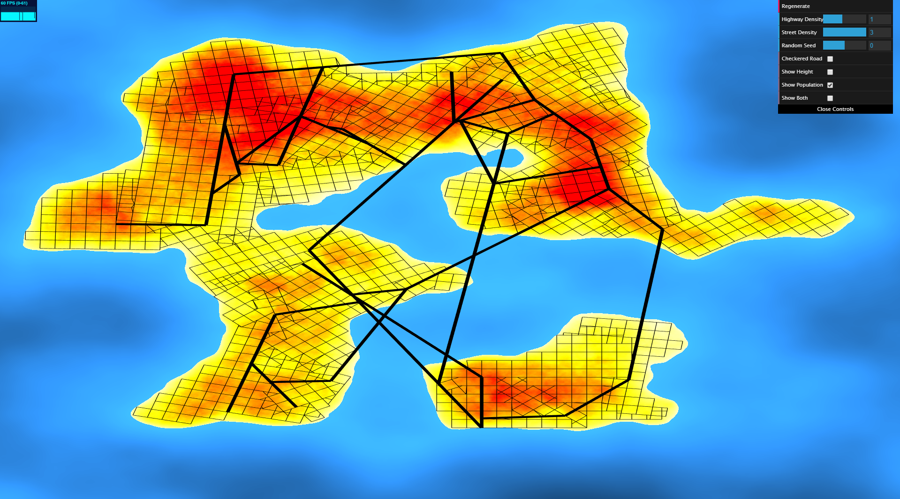
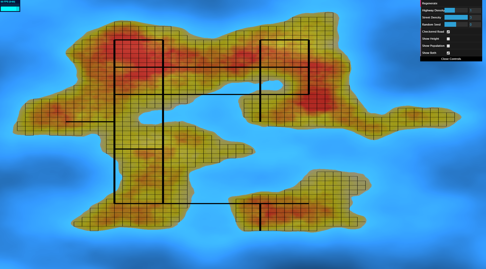

# Road Generation
_Created for CIS 566 Homework 5 in Spring 2019_

_Wei (Waley) Zhang (PennKey: wzha)_

[github.io Demo](https://greedyai.github.io/road-generation/)

## Features
- My scene consists of the following elements:
  - __Procedurally generated terrain__: The terrain consists of a procedurally generated height map and a procedurally generated population density map. Created using the following techniques:
    - The height map is generated using FBM with a standard noise function with quintic falloff for interpolation. Parameters have been manipulated to make the noise function more "coagulated" (ie. the land masses have fairly smooth edges).
    - The population density map is first generated using FBM with a standard noise function with quintic falloff for interpolation. The result is then fed into various bias functions alongside the height map to ensure that no one lives on water and that more people lives inland than on the beaches.
    - The procedurally generated terrain is "passed back" to the CPU via frame and render buffers (basically a texture) so that the CPU can store height and population density maps. This is done instead of computing the same noise functions on both the CPU and GPU to avoid floating point errors due to differing precision and library function implementations on the CPU and GPU.
  - __Highway system__: The highway system is generated using a pseudo L-system with the following rules:
    - At every step, the L-system's turtle randomly chooses 2 directions within a 180 arc (facing forward), one to its left and one to its right, to branch out to.
    - All branch angles are between 15 and 90 degrees, but randomly generated via a noise function.
    - After branching out, the turtle moves forward. If the turtle moves into water, it moves forward again and check if it is on land again. If so, the turtle completes this "double move" to create a bridge across the body of water. Therefore, as long as the highway density is not too high, the turtle can cross most bodies of water.
    - The turtle "dies" (ie. stops moving forward and branching out) if it can no longer branch out nor move forward without landing on water, and it cannot form a bridge.
    - The highway system is self-sensitive. It generates edges and intersections based on other highways in its local region, per section 3.3.1 of Procedural Modeling of Cities.
  - __Road system__: The road system is generated using a breadth-first-search version of a L-system with the following rules:
    - At every step, the L-system's turtle branches 90 degrees to its left and 90 degrees to its right.
    - After branching out, the turtle moves forward. If the turtle moves into water, it "dies", and we move onto the next turtle in the turtle queue.
    - The road system is self-sensitive. It generates edges and intersections based on other roads _and_ highways in its local region, per section 3.3.1 of Procedural Modeling of Cities.
  - __User controls via dat.GUI.__: The user can control the followings features in my scene:
    - Highway density. _Note: if the highways are too dense, it may not be able to cross large bodies of water._
    - Street density.
    - Random seed for initial turtle position of highway system.
    - Toggle for checkered road networking: if on, all roads will lie parallel to either the x or y axes.
    - Height vs. Population Density vs. Overlayed terrain maps.
    - "Regenerate" button: allows the user to manually regenerate the road system when desired--realtime updates of the scene are too inefficient.

## Screenshots
- __Non-checkered road networking, showing the population density map.__

- __Checkered road networking, showing the overlayed terrain map.__

## Citations
I adapted the code found [here](https://gist.github.com/gordonwoodhull/50eb65d2f048789f9558) to implement a function that determines the intersection point of two line segments.
